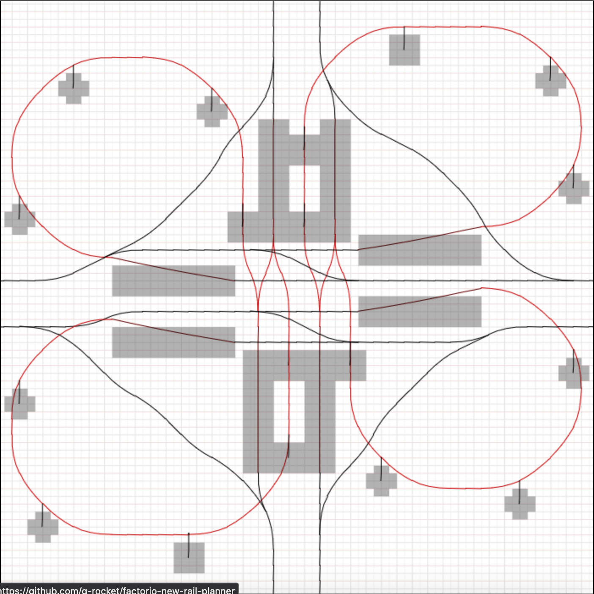

# A tool for planning factorio rail junctions using the new 2.0.0 rail features.

Featuring new rails from [FFF-377](https://www.factorio.com/blog/post/fff-377) and elevated rails from [FFF-378](https://www.factorio.com/blog/post/fff-378)

## Examples:

[4-way intersection](examples/cloverleaf-support.json):  

[Recreation](examples/fff-378-simple-junction.json) of [simple junction from FFF-378](https://cdn.factorio.com/assets/blog-sync/fff-378-junction-simple.png):

## Display:

- Light gray and light red display the tile grid.
- Black lines are ground-level rails; Red lines are elevated rails.
- If elevated rails are unsupported, they will have blue dashes. (Support calculations are from [this forum post](https://forums.factorio.com/viewtopic.php?p=592880#p592880)).
- Dark red lines are ramps; the grey "shadow" shows the footprint of the ramp.
- Supports show as vertical black lines with a grey "shadow" for the footprint.
- Green square shows currently selected location
- Teal/magenta lines show rail that will be placed when you click. (Teal for ground level, magenta for elevated).

## Instructions:

- Click to select the start location
- Hover over the end locations of a rail segment to show candidate rails starting there; click to place the rail.
- Further rails after the first are constrained to be in the same direction as the path you are drawing. Click with no hovered rail shown (double-click) to deselect the path.
- Go over a rail again to delete it.
- Copy the code string (listed in a text box at the bottom) to save your design, or paste a code string in there to load a design.
- Press "s" to enter support mode. Hover over elevated rail ends to show supports, and click to place
- Press "escape" to cancel whatever is shown.

## Known bugs:

- You might have to type (spaces) in the code string text box to get it to load

## Planned features:

- Signals:
  - From [an image on FFF-377](fff-377-signal-positions-and-rail-segment-visualisation-annotated.png), we have probably enough information to figure out where you can put signals. I should let you place rail signals, and visualize that somehow.
- Can we do collision detection?
  - I don't think we have enough information to figure out the bounding boxes of rails, and without that we can't know if there are collisions. But it would be really nice to highlight collisions between rails and ramps/supports.
- Better handling of code strings:
  - Load code string from URL so you can link to a design
  - Provide an easy way to get this "sharable link"
  - Maybe a save button that does something? Maybe a load button?
- Maybe a better way to export as an image instead of just taking a screenshot?
- Better graphics
- Allow the canvas to resize if you have a bigger / smaller screen

